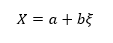
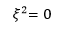
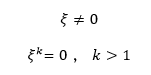
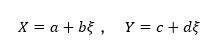
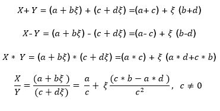
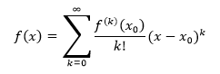
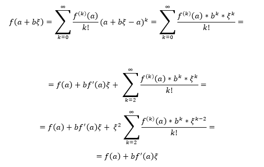

# ԳԼՈՒԽ 2
**Ավտոմատ դիֆերենցում։** Ավտոմատ դիֆերենցման մեթոդները։ Դուալ թվերի կապը դիֆերենցման հետ։  

## 2.1 Դուալ թվեր

Դուալ թվերը առաջին անգամ սահմանել և նկարագրել է անգլիացի մաթեմատիկոս Վիլյամ Քլիֆորդը 1873 թվականին։ Դուալ թվերը սովորաբար ներկայացվում է հետևյալ բանաձևով.

որտեղ a-ն և b-ն իրական թվեր են, իսկ ξ-ն այնպիսի աբստրակտ պարամետր է (միավոր է), որն ունի հետևյալ հատկությունը.

Դուալ թիվը հավասար է 0-ի, երբ a = 0, և b= 0 ։ a-ն կոչվում է դուալ թվի գլխավոր մաս (նշանակվում է  Re-ով), իսկ bξ-ն կոչվում է դուալ թվի դուալ կամ աբստրակտ մաս (նշանակվում է  Im-ով)։ Ընդ որում

Ենթադրենք ունենք հետևյալ դուալ թվերը.

Դուալ թվերի համար սահմանենք գումարման, հանման, բազմապատկման և բաժանման բանաձևերը.

## 2.2 Դուալ թվերի կապը դիֆերենցման հետ

Այս ենթագլխում ցույց տանք թե ինչպես կարելի է ստանալ ֆունկցիայի մասնակի ածանցյալի արժեքը, և ֆունկցիայի արժեքը ինչ-որ կետերում, օգտվելով դուալ թվերից։ Հաշվենք դուալ թվից կախված ֆունկցիան, օգտվելով Թեյլորի շարքից.

x-ի փոխարեն տեղադրենք a+bξ, կստանանք.

Այստեղից հետևում է, որ եթե $x = a$-ի փոխարեն տեղադրենք $f(x)$ ֆունկցիայում $x = a + b\xi$ արժեքը, ապա կստանանք և՛ ֆունկցիայի արժեքը $x = a$ կետում, այսինքն $f(a)$-ն, և՛ $f(x)$ ֆունկցիայի ածանցյալի արժեքը $x = a$ կետում, այսինքն $f'(a)$-ն։ Դիտարկենք հետևյալ օրինակը.

