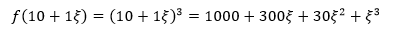
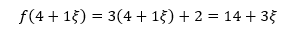

# ԳԼՈՒԽ 2
**Ավտոմատ դիֆերենցում։** Ավտոմատ դիֆերենցման մեթոդները։ Դուալ թվերի կապը դիֆերենցման հետ։  

## 2.1 Դուալ թվեր

Դուալ թվերը առաջին անգամ սահմանել և նկարագրել է անգլիացի մաթեմատիկոս Վիլյամ Քլիֆորդը 1873 թվականին։ Դուալ թվերը սովորաբար ներկայացվում է հետևյալ բանաձևով.

որտեղ a-ն և b-ն իրական թվեր են, իսկ ξ-ն այնպիսի աբստրակտ պարամետր է (միավոր է), որն ունի հետևյալ հատկությունը.

Դուալ թիվը հավասար է 0-ի, երբ a = 0, և b= 0 ։ a-ն կոչվում է դուալ թվի գլխավոր մաս (նշանակվում է  Re-ով), իսկ bξ-ն կոչվում է դուալ թվի դուալ կամ աբստրակտ մաս (նշանակվում է  Im-ով)։ Ընդ որում

Ենթադրենք ունենք հետևյալ դուալ թվերը.

Դուալ թվերի համար սահմանենք գումարման, հանման, բազմապատկման և բաժանման բանաձևերը.

## 2.2 Դուալ թվերի կապը դիֆերենցման հետ

Այս ենթագլխում ցույց տանք թե ինչպես կարելի է ստանալ ֆունկցիայի մասնակի ածանցյալի արժեքը, և ֆունկցիայի արժեքը ինչ-որ կետերում, օգտվելով դուալ թվերից։ Հաշվենք դուալ թվից կախված ֆունկցիան, օգտվելով Թեյլորի շարքից.

x-ի փոխարեն տեղադրենք a+bξ, կստանանք.

Այստեղից հետևում է, որ եթե $x = a$-ի փոխարեն տեղադրենք $f(x)$ ֆունկցիայում $x = a + b\xi$ արժեքը, ապա կստանանք և՛ ֆունկցիայի արժեքը $x = a$ կետում, այսինքն $f(a)$-ն, և՛ $f(x)$ ֆունկցիայի ածանցյալի արժեքը $x = a$ կետում, այսինքն $f'(a)$-ն։ Դիտարկենք հետևյալ օրինակը.

**Օրինակ։**

Ենթադրենք տրված է հետևյալ ֆունկցիան՝ $f(x)= x^3$: Պահանջվում է գտնել ֆունկցիայի ածանցյալի արժեքը $x= 10$ կետում։ Ինչպես գիտենք ֆունկցիայի ածանցյալը տվյալ կետում հավասար է՝ $f'(a)= 3 * 〖10〗^2=300$, իսկ ֆունկցիայի արժեքը տվյալ կետում՝ $f(a)=1000$։ Այժմ հաշվենք ֆունկցիայի ածանցյալի արժեքը, օգտվելով դուալ թվերից։ Տեղադրենք ֆունկցիայում $x= 10$ -ի փոխարեն $x= 10+1\xi$, կստանանք.

Ըստ սահմանման $30\xi^2= 0, \ \xi^3= 0$, հետևում է, որ $f(10+1\xi)=1000+300\xi$, որտեղ $1000$-ը մեր $a$-ն է, այսինքն ֆունկցիայի արժեքը տվյալ կետում, իսկ $300$-ը $1*b$-ն է, այսինքն ֆունկցիայի ածանցյալի արժեքը տվյալ կետում։
Այսպիսով ստավեց, որ դուալ թվերի միջոցով կարող ենք առանց ֆունկցիայի ածանցյալ հաշվելու, գտնել ֆունկցիայի ածանցյալի արժեքը տվյալ կետում։ Դուալ թվերի այս հատկությունը կիրառվում է ավտոմատ դիֆերենցման ուղիղ և հակադարձ մեթոդների մեջ։

## 2.3 Ավտոմատ դիֆերենցում
Մաթեմատիկայում և համակարգչային հանրահաշվում ավտոմատ դիֆերենցումը իրենից ներկայացնում է մեթոդների հավաքածու, որոնք նախատեսված են համակարգչային ծրագրերի միջոցով հաշվելու ֆունկցիայի ածանցյալիների թվային արժեքները։ Ավտոմատ դիֆերենցմանը հաճախ անվանում են նաև ալգորիթմական կամ հաշվողական դիֆերենցում։ Ացտոմատ դիֆերենցումը հիմնվում է այն փաստի վրա, որ ցանկացած բարդ համակարգչային ծրագիր, վերջ ի վերջո կառուցված է, և կազմված է  տարրական թվաբանական գործողությունների (գումարում, հանում, բազմապատկում, բաժանում և այլն), և տարրական մաթեմատիկական ֆունկցիաների (օրինակ՝ exp,log,sin,cos, և այլն) հաջորդականությունից։ Այսիքն կամայական կարգի ածանցյալների հաշվարկը, իրենից ներկայացնում է այս գործողությունների հաջորդական կիրառումը։
Այս մեթոդը տարբերվում է ինչպես սիմվոլային դիֆերենցումից, այնպես էլ թվային դիֆերենցումից։ Սիմվոլային դիֆերենցման ժամանակ երբեմն ստացվում է ծավալուն, անարդյունավետ արտահայտություններ, որը համակարգչային ծրագրով իրականացման ժամանակ առաջացնում է բարդություններ։ Թվային դիֆերենցումը ևս ունի թերություններ, որոնց հիմնական պատճառը սխալի կլորացումն է։ Այս երկու դասական մոտեցումներն ունեն նաև խնդիրներ՝ բազմաթիվ փոփոխականներով ֆունցիաների մասնակի ածանցյալների հաշվարկման ժամանակ, ինչը շատ կարևոր է օպտիմալացման խնդիրներում, գրադիենտային մեթոդներում, որոնք հիմնականում կիրառվում են մեքենայական ուսուցման մեջ։ Ավտոմատ դիֆերենցումը լուծում է նշված բոլոր խնդիրները։ Ավտոմատ դիֆերենցումը կազմված է երկու հիմնական մեթոդից՝ ուղիղ մեթոդ և հակադարձ մեթոդ։

Դիտարկենք ավտոմատ դիֆերենցման մի օրինակ։

**Օրինակ։**

Ենթադրենք տրված է հետևյալ ֆունկցիան՝ $f(x)=3x+2$, և գտնենք $f(4)$-ը և $f'(4)$։ Առաջին քայլով, $x= 4$ –ի փոխարեն տեղադրում ենք ֆունկցիայում $x= 4+1\xi$ արժեքը.

Որտեղ $14$-ը ֆունկցիայի արժեքն է $x= 4$ կետում, իսկ $3\xi$ դուալ մասն է, որը համապատասխանում է $f'(4)$-ին։ Այս մոտեցումը հայտնի է որպես ավտոմատ դիֆերենցման ուղիղ մեթոդ, որի ժամանակ ածանցյալը հաշվարկվում է զուգահեռաբար, հիմնական ֆունկցիայի արժեքի հաշվարկման հետ, սկսած ալգորիթմի սկզբից մինչև վերջ։

## 2.4 ՈՒղիղ և Հակադարձ մեթոդներ

**Սահմանում։**  

Հաշվողական գրաֆը այն գրաֆն է, որտեղ գագաթները (հանգույցները) իրենցից ներկայացնում են մաթեմատիկական գործողություններ (օրինակ՝ գումարում, բազմապատկում, և այլն), իսկ  եզրերը (կողերը) իրենցից ներկայացնում են տվյալներ (փոփոխականներ կամ միջանկյալ արդյունքներ)։ Հաշվողական գրաֆները օգտագործվում են հաշվարկները ներկայացնելու համար, որպես գործողությունների հաջորդականություն, որոնք պետք է կատարվեն։ Այս պարագայում կարող ենք նմանեցնել այն ալգորիթմի բլոկ սխեմանների հետ։

