# ԳԼՈՒԽ 3

## Դիֆերենցիալ հավասարման ցանցային ձևակերպում: Ցանցային մեթոդ: Ընդհանուր գաղափարներ։

Դիֆերենցիալ հավասարման ցանցային սխեման գրելու համար անհրաժեշտ է կատարել հետևյալ երկու քայլերը.
1. անհրաժեշտ է անընդհատ տիրույթը փոխարինել դիսկրետ տիրույթով,  
2. անհրաժեշտ է դիֆերենցիալ օպերատորը փոխարինել որոշակի տարբերութային օպերատորով, ինչպես նաև ձևակերպել և սահմանել համարժեք սկզբնական պայմանները տարբերութային հավասարման համար։

Այս երկու քայլերը կատարելուց հետո, մենք ստանում ենք հանրահաշվական հավասարումների համակարգ: Այսպիսով տրված դիֆերենցիալ  հավասարման թվային լուծման խնդիրը բերվում է հանրահաշվական հավասարումների համակարգի լուծման խնդրի:  Թվային մեթոդով, երկու մաթեմատիկական խնդրի լուծման դեպքում էլ  ակնհայտ է, որ չենք կարող գտնել լուծումները բոլոր հնարավոր կետերում: Հետևաբար, բնական է այդ  տիրույթում ընտրել վերջավոր կետերի բազմություն, և խնդրի մոտավոր լուծումը փնտրել միայն այդ կետերում : Այդ կետերի բազմությանը անվանում են ցանց, իսկ բազմության առանձին կետերին ՝ ցանցի հանգույցներ կամ ցանցի կետեր:  Ցանցի հանգույցներում (կետերում) սահմանված ֆունկցիան կոչվում է ցանցային ֆունկցիա:  Այսպիսով մենք անընդհատ տիրույթը փոխարինեցինք դիսկրետ տիրույթով, այսինքն ցանցով: Դիտարկենք մի քանի օրինակներ:

## Օրինակ 1. <<Հավասարաչափ ցանց հատվածի վրա>>

[0;1] հատվածը հավասարաչափ բաժանենք N հավասար մասերի: Երկու հարևան հանգույցների հեռավորությունը նշանակենք h-ով.

h-ին կանվանենք ցանցի քայլ: 

Այս կառուցվածքը կոչվում է հավասարաչափ ցանց, քանի որ բոլոր հանգույցների միջև եղած հեռավորությունը նույնն է: Բոլոր հանգույցների բազմությունը նշանակենք  ωₕ-ով.

$\omega_h$-ը իրենից ներկայացնում է ցանց, որը տվյալ դեպքում կառուցվել է հատվածի վրա: Այս ձևով սահմանված ցանցը ներքին հանգույցներ է պարունակում, առանց եզրային կետերի՝ $x_0 = 0$ և $x_N = 1$: Այս բազմության մեջ կարելի է ներառել նաև եզրային կետերը: Այդ դեպքում ցանցը կսահմանենք հետևյալ կերպ.

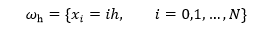

Այսպիսով $[0;1]$ հատվածի վրա $y(x)$ անընդհատ ֆունկցիայի փոխարեն կդիտարկենք դիսկրետ արգումենտի ֆունկցիա՝ $y_h(x_i)$,  $i = 0,1,\dots,N$։ Ֆունկցիայի արժեքները հաշվարկվում են ցանցի հանգույցներում $(x_i$-ում), 
իսկ ֆունկցիան կախված է ցանցի քայլից $(h$-ից)։

## Օրինակ 2.  <<Հավասարաչափ ցանց հարթության վրա>>

Դիտարկենք երկու փոփոխականից կազմված $u(x,t)$ ֆունկցիաների բազմությունը։ Ենթադրենք մեր ֆունկցիայի որոշման $\overline{D}$ տիրույթը իրենից ներկայացնում է ուղղանկյուն.

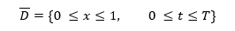

Բաժանենք $x$ առանցքի $[0;1]$ հատվածը $N_1$ հավասար մասերի, իսկ $t$ առանցքի $[0;1]$ հատվածը $N_2$ հավասար մասերի։ Կատարենք նշանակում.

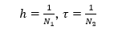

որտեղ h-ը ցանցի քայլն է x-ի ուղղությամբ, իսկ  τ-ն ցանցի քայլն է t-ի ուղղությամբ:

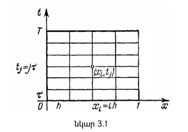

Գծելով և կառուցելով ուղիղները զուգահեռ համապատասխան առանցքներին (Նկ. 3.1), ստանում ենք ուղղանկյուն ցանց, որի հանգույցները (կետերը) տրված են $(x_i, t_j)$ զույգերով, որտեղ $x_i = i h$,  $t_j = j \tau$,  $i = 0,1,\dots,N_1$,  $j = 0,1,\dots,N_2$։ $\overline{\omega}_{h\tau}$-ով նշանակենք $(x_i, t_j)$ կետերի բազմությունը $\overline{D}$ տիրույթում.

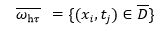

Այս ցանցը ունի երկու $h$ և $\tau$ քայլեր, համապատասխան $x$ և $t$ ուղղություններով։ Ցանցի հարակից (կամ հարևան) հանգույցներ կոչվում են այն կետերը, որոնք գտնվում են նույն ուղղու վրա 
(կամ հորիզոնական, կամ ուղղաձիգ), և այդ կետերի միջև եղած հեռավորությունը հավասար է ցանցի քայլին (կամ $h$-ին, կամ $\tau$-ին)։

## Օրինակ 3.  <<Անհավասարաչափ ցանց հատվածի վրա>>**

Դիտարկենք $0 \le x \le 1$ հատվածը։ Բաժանենք այն $N$ անհավասար մասերի՝ $0 < x_1 < x_2 < \dots < x_{N-1} < 1$։ $\omega_h$-ով նշանակենք հանգույցների բազմությունը.

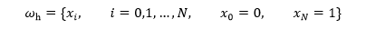

$\omega_h$-ը իրենից ներկայացնում է անհավասարաչափ ցանց $[0;1]$ հատվածի վրա։ Հարակից հանգույցների միջև հեռավորությունը, այսինքն՝ ցանցի քայլը, սահմանվում է հետևյալ կերպ.

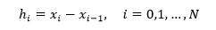

$h$ քայլը կախված է հանգույցի $i$ համարից։ Ցանցի քայլերը պետք է բավարարեն հետևյալ պայմանին.

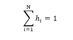

## Օրինակ 4.  <<Ցանց երկչափ տիրույթում>>**

Դիտարկենք $(x_1, x_2)$ ուղղանկյուն կոորդինատական համակարգը, և այդ համակարգում ինչ-որ $G$ տիրույթ։ $G$ տիրույթի եզրը նշանակենք $\Gamma$–ով։ Տրոհենք տիրույթը ցանցով, այսինքն կառուցենք, տանենք $x_1$–ին և $x_2$–ին զուգահեռ ուղիղները.

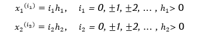

Այսպիսով, հարթության վրա ստանում ենք ուղղանկյուն ցանց, որի հանգույցները տրված են հետևյալ բանաձևով.

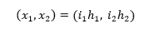

որտեղ $i_1, i_2 \in \mathbb{Z}$։ Այս ցանցը հավասարաչափ է երկու ուղղություններով, այսինքն և՛ ըստ $O x_1$–ի, և՛ ըստ $O x_2$–ի։ Մեզ հետաքրքրում է ցանցի միայն այն հանգույցները, որոնք պատկանում են $\overline{G}$ տիրույթին.

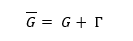

