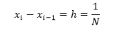
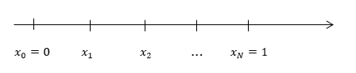
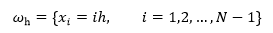

# ԳԼՈՒԽ 3

**Դիֆերենցիալ հավասարման ցանցային ձևակերպում: Ցանցային մեթոդ: Ընդհանուր գաղափարներ։**
## Դիֆերենցիալ հավասարման ցանցային ձևակերպում: Ցանցային մեթոդ: Ընդհանուր գաղափարներ։

Դիֆերենցիալ հավասարման ցանցային սխեման գրելու համար անհրաժեշտ է կատարել հետևյալ երկու քայլերը.
1. անհրաժեշտ է անընդհատ տիրույթը փոխարինել դիսկրետ տիրույթով,  
2. անհրաժեշտ է դիֆերենցիալ օպերատորը փոխարինել որոշակի տարբերութային օպերատորով, ինչպես նաև ձևակերպել և սահմանել համարժեք սկզբնական պայմանները տարբերութային հավասարման համար։

Այս երկու քայլերը կատարելուց հետո, մենք ստանում ենք հանրահաշվական հավասարումների համակարգ: Այսպիսով տրված դիֆերենցիալ  հավասարման թվային լուծման խնդիրը բերվում է հանրահաշվական հավասարումների համակարգի լուծման խնդրի:  Թվային մեթոդով, երկու մաթեմատիկական խնդրի լուծման դեպքում էլ  ակնհայտ է, որ չենք կարող գտնել լուծումները բոլոր հնարավոր կետերում: Հետևաբար, բնական է այդ  տիրույթում ընտրել վերջավոր կետերի բազմություն, և խնդրի մոտավոր լուծումը փնտրել միայն այդ կետերում : Այդ կետերի բազմությանը անվանում են ցանց, իսկ բազմության առանձին կետերին ՝ ցանցի հանգույցներ կամ ցանցի կետեր:  Ցանցի հանգույցներում (կետերում) սահմանված ֆունկցիան կոչվում է ցանցային ֆունկցիա:  Այսպիսով մենք անընդհատ տիրույթը փոխարինեցինք դիսկրետ տիրույթով, այսինքն ցանցով: Դիտարկենք մի քանի օրինակներ:

## Օրինակ 1. <<Հավասարաչափ ցանց հատվածի վրա>>

[0;1] հատվածը հավասարաչափ բաժանենք N հավասար մասերի: Երկու հարևան հանգույցների հեռավորությունը նշանակենք h-ով.

h-ին կանվանենք ցանցի քայլ: 

Այս կառուցվածքը կոչվում է հավասարաչափ ցանց, քանի որ բոլոր հանգույցների միջև եղած հեռավորությունը նույնն է: Բոլոր հանգույցների բազմությունը նշանակենք  ωₕ-ով.

