# ԳԼՈՒԽ 4
Ցանցային և ավտոմատ դիֆերենցման մեթոդների կիրառումը բույսերում ջերմափոխանակության հավասարման լուծման համար

## 4.1 Ջերմափոխանակության հավասարման թվային լուծում ցանցային մեթոդով

Ենթադրենք, տրված է հետևյալ դիֆերենցիալ հավասարումների համակարգը.

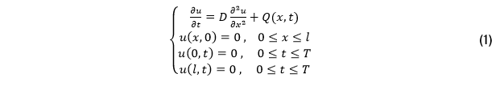

որտեղ $u(x,t)$-ն ցույց է տալիս ջերմաստիճանը $x$ դիրքում և $t$ ժամանակի պահին, $D$-ն դիֆուզիայի գործակիցն է, և հաստատուն է։ Այն ցույց է տալիս, թե որքան արագ է տարածվում ջերմությունը (նյութը, մասնիկները) միջավայրի մեջ։  
$Q(x,t)$-ն ջերմաքանակն է, այսինքն, միավոր ծավալում և միավոր ժամանակում ստացվող (կամ կլանվող) ջերմության քանակը։ Մեր մոդելում, բույսի հյուսվածքը յուրաքանչյուր $x$-ում և յուրաքանչյուր $t$-ում ստանում է ջերմաքանակ, հետևյալ հավասարումով.՝

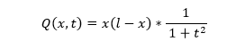

Մագիստրոսական թեզի և գիտական հոդվածների շրջանակներում, վերցրել ենք $D$–ի հետևյալ արժեքը.

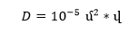

Սահմանային և սկզբնական պայմանները սահմանվել են, հաշվի առնելով որոշ ենթադրություններ, և հյուսվածքի ֆիզիկաքիմիական հատկություններ։ $u(x,0)=0$ սկզբնական պայմանը ցույց է տալիս, որ $t=0$ պահին բույսի ամբողջ հատվածում (միջավայրում) ջերմաստիճանը հավասար է 0-ի, այսինքն ջերմափոխանակությունը դեռ չի սկսվել։ Սա իր հերթին նշանակում է, որ բույսի հյուսվածքը (միջավայրը) համասեռ է, այսինքն ունի նույն ջերմային հատկությունները ամբողջ $x_0=0$ երկարությամբ, $t=0$ պահին։ $u(0,t)=0$ և $u(l,t)=0$ սահմանային պայմանները ցույց են տալիս, որ բույսի մոդելավորված հատվածի ծայրերում ջերմաստիճանը պահվում է հաստատուն, այսինքն եզրային հատվածները համարվում են ջերմաստիճանով (կայուն) հաստատուն հատվածներ։

Նախքան խնդրին անցնելը, նախ դիտարկենք ընդհանուր դեպքը և կառուցենք ցանցը։

**Քայլ 1.**  
Առաջին քայլով, տարածությունը և ժամանակը բաժանում ենք համապատասխանաբար $M$ և $N$ հավասար մասերի, $\Delta x$ և $\Delta t$ քայլերով (նկ. 4.1).

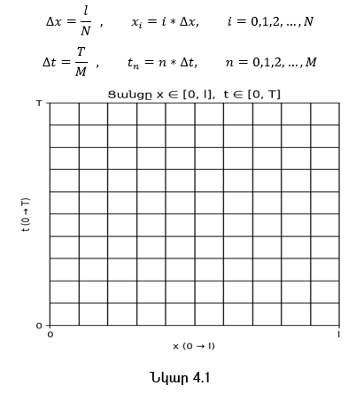

**Քայլ 2.**  
Երկրորդ քայլով, դիֆերենցիալ հավասարումը մոտարկում ենք տարբերութային հավասարումով.

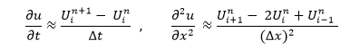

որտեղ $U_i^n$–ը ցույց է տալիս ֆունկցիայի արժեքը $u(x,t)$ կետում.՝

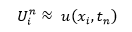

$i$–ն տարածական ցանցի ինդեքսն է, իսկ $n$–ը ժամանակային ցանցի ինդեքսն է։ Համաձայն այս նշանակման, ջերմաքանակի համար կստանանք հետևյալ բանաձևը.

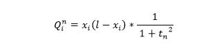

**Քայլ 3.**  
Երրորդ քայլով, տեղադրելով (1) համակարգի առաջին հավասարման մեջ, կստանանք.

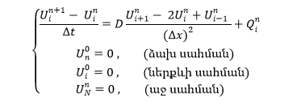

Մեծ հաշվարկներից խուսափելու համար, կատարենք նշանակում.

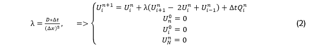

Այժմ դիտարկենք մեր մասնավոր դեպքը։ Ենթադրենք մեր ցանցը, ըստ ժամանակի, և ըստ տարածության բաժանված է համապատասխանաբար 5 հավասար մասերի։ Ենթադրենք ունենք $10\,\textսմ = 0.1\,\textմ$ հյուսվածք, և այն բաժանում ենք $N = 5$ հավասար մասերի, $i = 0,1,2,3,4,5$։ Ենթադրենք նաև ունենք $100\,\textվ$ ժամանակ, որը նույնպես բաժանված է $M = 5$ հավասար մասերի, $n = 0,1,2,3,4,5$ (նկ. 4.2 և նկ. 4.3).

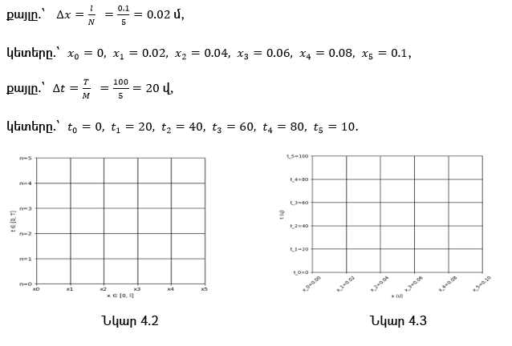

**Քայլ 1.**  
Կատարենք առաջին ժամանակային քայլը ($n=0 \rightarrow n=1$)։ Քանի որ ժամանակի $t=0$ պահին, ամբողջ հատվածում ջերմաստիճանը 0 է, ապա.

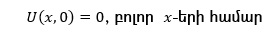

որին համապատասխանում է n=0 շերտը ցանցում.

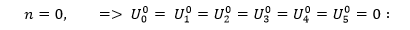

(2)-րդ համակարգի առաջին հավասարման մեջ, տեղադրելով $n=0$, կստանանք հետևյալ բանաձևը.

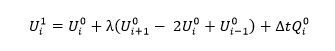

**Քայլ 2.**  
Այժմ, մինչ $U_1^1, U_2^1, U_3^1, U_4^1$ արժեքներին անցնելը, հաշվենք $\lambda$–ն և $Q_i^n$ արժեքները (Աղյուսակ 4.1), քանի որ հետագա բոլոր հաշվարկներում միշտ պետք է գալու.

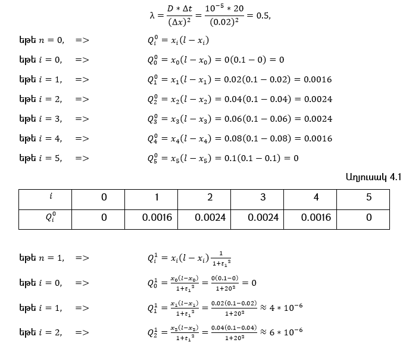

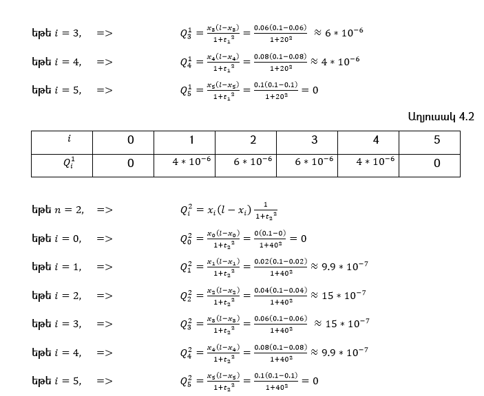

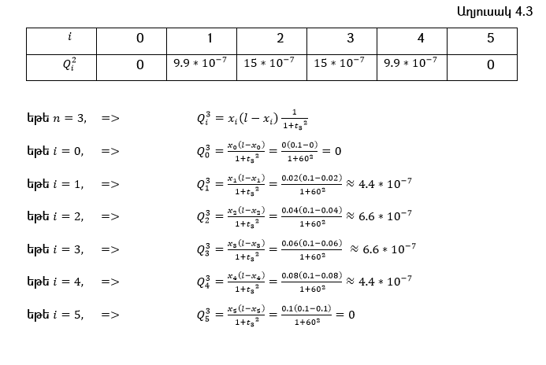

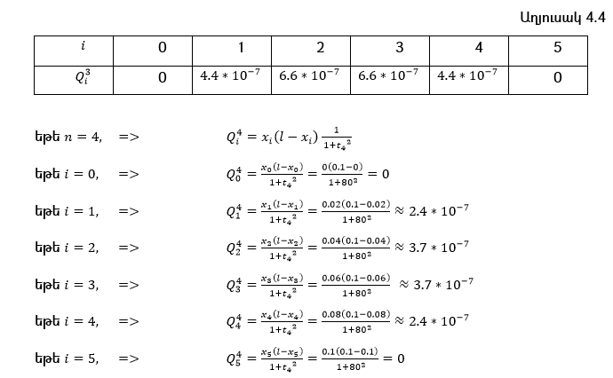

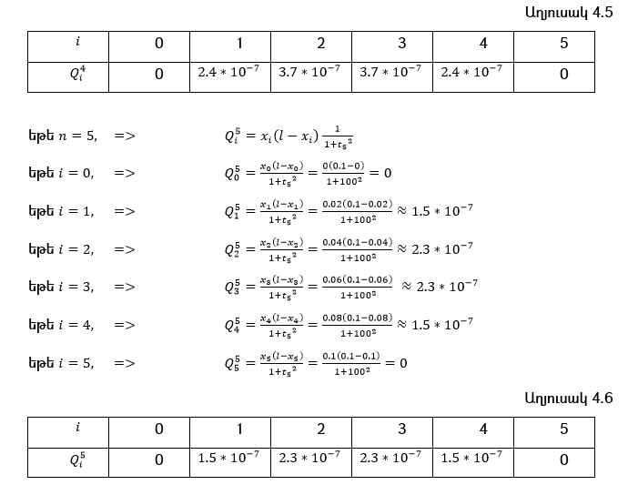

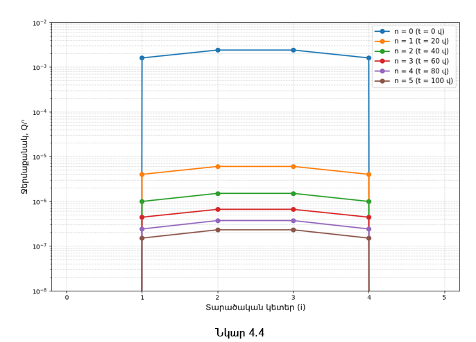

Պատկերված գրաֆիկը (նկ. 4.4) և (Աղյուսակ 4.1 - Աղյուսակ 4.6) արժեքները ցույց են տալիս, որ ժամանակի ընթացքում ջերմաքանակը նվազում է բոլոր կետերում, կենտրոնից դեպի եզրեր տարածվելով և գրեթե հավասարաչափ դառնալով։ Դա բնորոշ է ջերմային պրոցեսին, որտեղ սկզբնական էներգիան աստիճանաբար բաշխվում է ամբողջ միջավայրում, մինչև հավասարակշռության վիճակին հասնելը։

**Քայլ 3.**  
Այժմ, կատարենք առաջին ժամանակային քայլը ($n=0 \rightarrow n=1$)։ Հաշվենք $U_1^1, U_2^1, U_3^1, U_4^1$ (Աղյուսակ 4.7) արժեքները՝ օգտվելով հետևյալ բանաձից.

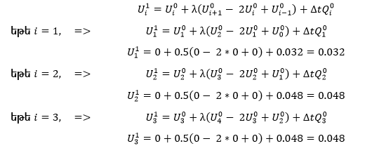

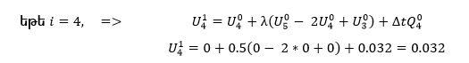

Առաջին ժամանակային քայլից հետո, կստանանք հետևյալ արժեքները (նկ. 4.5).

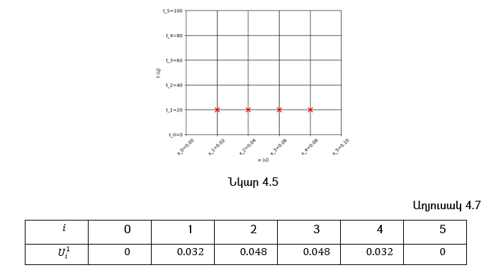

**Քայլ 4.**  
Կատարենք երկրորդ ժամանակային քայլը ($n=1 \rightarrow n=2$)։ (2)-րդ համակարգի առաջին հավասարման մեջ, տեղադրելով $n=1$, կստանանք հետևյալ բանաձևը.

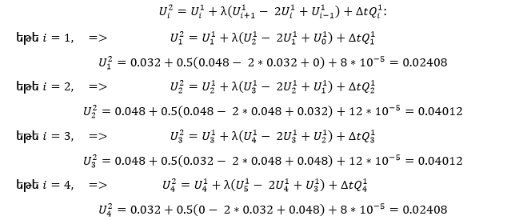

Երկրորդ ժամանակային քայլից հետո, կստանանք հետևյալ արժեքները (նկ. 4.6 և Աղյուսակ 4.8).

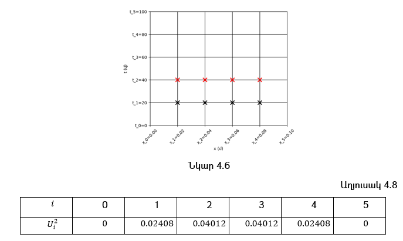

**Քայլ 5.**  
Կատարենք երրորդ ժամանակային քայլը ($n=2 \rightarrow n=3$)։ (2)-րդ համակարգի առաջին հավասարման մեջ, տեղադրելով $n=2$, կստանանք հետևյալ բանաձևը.

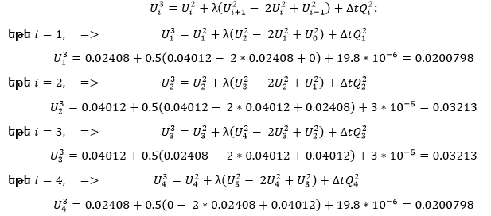

Երրորդ ժամանակային քայլից հետո, կստանանք հետևյալ արժեքները (նկ. 4.7 և Աղյուսակ 4.9).

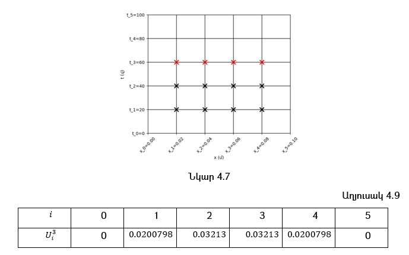

**Քայլ 6.**  
Կատարենք չորրորդ ժամանակային քայլը ($n=3 \rightarrow n=4$)։ (2)-րդ համակարգի առաջին հավասարման մեջ, տեղադրելով $n=3$, կստանանք հետևյալ բանաձևը.

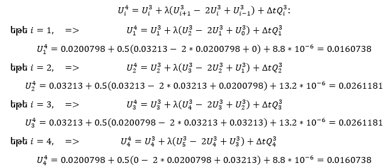

Չորրորդ ժամանակային քայլից հետո, կստանանք հետևյալ արժեքները (նկ. 4.8 և Աղյուսակ 4.10).

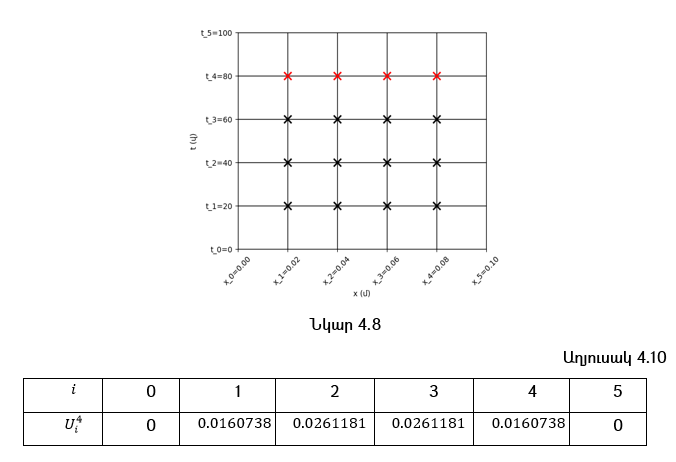

**Քայլ 7.**  
Կատարենք հինգերորդ ժամանակային քայլը ($n=4 \rightarrow n=5$)։ (2)-րդ համակարգի առաջին հավասարման մեջ, տեղադրելով $n=4$, կստանանք հետևյալ բանաձևը.

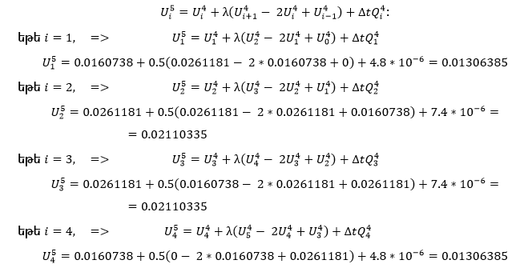

Հինգերորդ ժամանակային քայլից հետո, կստանանք հետևյալ արժեքները (նկ. 4.9 և Աղյուսակ 4.11).

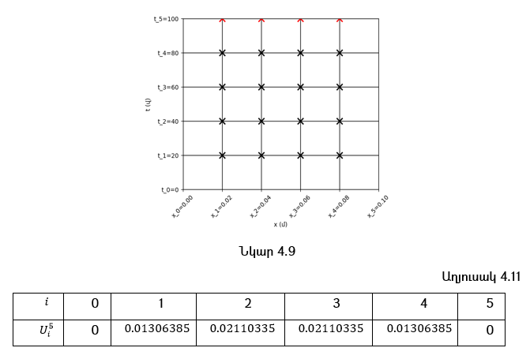

Այսպիսով, ստացվեց որ դիֆերենցիալ հավասարման խնդրի տարբերութային մոտարկման արդյունքում, ստացվում է գծային հավասարումների համակարգ, որի լուծման մեթոդները բաժանվում են 2 տեսակի՝ ուղիղ և իտերացիոն։ Ուղիղ են կոչվում այն մեթոդները, որոնց միջոցով կարելի է ստանալ խնդրի ճշգրիտ լուծումը վերջավոր թվով թվաբանական գործողություններից հետո։ Օրինակ.՝ մոնոտոն քշման մեթոդը (Թոմասի ալգորիթմ), ոչ մոնոտոն քշման մեթոդը, մատրիցային քշման մեթոդը, և այլն։ Իտերացիոն կոչվում են այն մեթոդները, որոնց միջոցով կարելի է ստանալ խնդրի մոտավոր լուծումը կամայական ճշտությամբ վերջավոր թվով թվաբանական գործողություններից հետո։ Մագիստրոսական թեզում և գիտական հոդվածներում օգտագործվել է իտերացիոն մեթոդը, որի շնորհիվ ստացվել է խնդրի մոտավոր լուծումը։ Այժմ հաշվի առնելով Աղյուսակ 4.7 - Աղյուսակ 4.11, և նկ. 4.5 – նկ. 4.9, կառուցենք մի գրաֆիկ (նկ. 4.10).

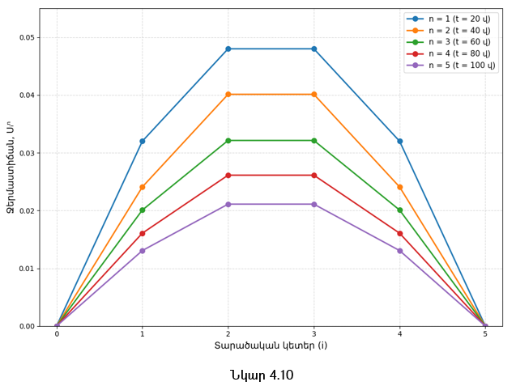

Գրաֆիկը ցույց է տալիս ջերմության տարածման դինամիկան բույսի հյուսվածքում, ժամանակի ընթացքում, ջերմաքանակի և հաստատուն դիֆուզիոն գործակցի պայմաններում։ Ինչպես տեսնում ենք, սկզբում ջերմաստիճանը բավականին բարձր է, այնուհետև աստիճանաբար նվազում է։ Ժամանակի ընթացքում փոփոխությունը դառնում է ավելի աննշան և մոտենում է կայուն մակարդակի։ Ֆիզիկայի տեսանկյունից դա նշանակում է որ բույսի հյուսվածքում ջերմաստիճանը այլևս չի նվազում, այսինքն ջերմության փոփոխությունը դադարում է զգալիորեն փոփոխվել։

## 4.2 Ջերմափոխանակության հավասարման լուծում ավտոմատ մեթոդով

Ենթադրենք, նորից տրված է հետևյալ դիֆերենցիալ հավասարումների համակարգը.

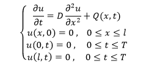

որը, ինչպես տեսանք նախորդ ենթագլխում ընդունում էր հետևյալ տեսքը. 

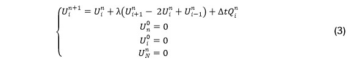

**Քայլ 1.**  
Առաջին քայլով, սահմանում ենք բոլոր ֆիզիկական պարամետրերը, և կատարում նշանակումը.

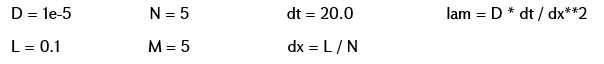

**Քայլ 2.**  
Համաձային առաջին քայլին, մենք ունենք $(M+1)$ ժամանակային կետ՝ $(t_0, t_1, t_2, t_3, t_4, t_5)$, և $(N+1)$ հատ տարածական կետ՝ $(x_0, x_1, x_2, x_3, x_4, x_5)$։ Մենք ի սկզբանե չգիտենք $u(x,t)$ արժեքները, այդ պատճառով վերցնում ենք (գեներացնում ենք) պատահական բնական թվեր, հաշվի առնելով սկզբնական և սահմանային պայմանները։ Այսինքն մեր մոդելը «սովորելու» է ներքին կետերը $(x_1 t_i, x_2 t_i, x_3 t_i, x_4 t_i), \; i=1,2,\dots,5$ (ներքին հանգույցները) (նկ. 5.11), քանի որ ըստ մեր սահմանային և սկզբնական պայմանների՝ $U_0^0 = U_1^0 = U_2^0 = U_3^0 = U_4^0 = U_5^0 = 0$, $U_0^0 = U_0^1 = U_0^2 = U_0^3 = U_0^4 = U_0^5 = 0$,  և  $U_5^0 = U_5^1 = U_5^2 = U_5^3 = U_5^4 = U_5^5 = 0$ (նկ. 4.12)։

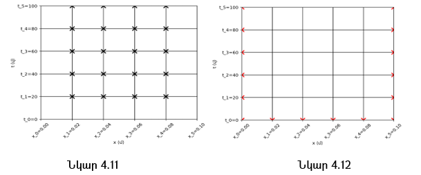

Այդ դեպքում, մեր ներքին կետերից կազմված մատրիցը (նշանակենք $P(n,i)$–ով), կունենա հետևյալ տեսքը.

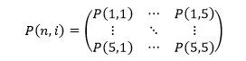

որի  տարրերը առաջին քայլում իրենցից ներկայացնում են պատահական բնական թվեր։ Քանի որ torch.randn()-ով գեներացնում ենք պատահական թվեր, դա նշանակում է որ արժեքները սկզբում կարող են լինել շատ մեծ։ Մեր խնդիրն է այդ $P$ –ի արժեքները փոքրացնել, քանի որ մեծ արժեքները կարող են առաջացնել անկայուն օպտիմալացում (unstable optimization)։ Այդ պատճառով մատրիցի բոլոր տարրերը բազմապատկում ենք 0.001-ով։ torch.nn.Parameter-ը $P$ մատրիցը դարձնում է  learnable parametr (ուսուցանվող պարամետր), որը optimizer-ը (օպտիմալացման ալգորիթմը) կարող է փոխել։

