# ԳԼՈՒԽ 5
## Ցանցային և ավտոմատ դիֆերենցման մեթոդների կիրառումը հարթ թիթեղների ճկման հաշվարկներում

## 5.1 Կոշտ ամրացված թիթեղի ճկման մաթեմատիկական մոդել

Ենթադրենք, տրված է $D$ տիրույթում հետևյալ դիֆերենցիալ հավասարումը.

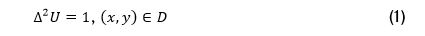

Դիրիխլեի եզրային պայմաններով.

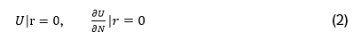

Որտեղ $U(x,y)$–ն 2 անհայտ փոփոխականների սկալյառ ֆունկցիա է, որը պատկերում է թիթղը հարթությունում։ $r$–ը թիթեղի մակերևույթի եզրն է՝ $r = \partial D$, իսկ $D$–ն մակերևույթի ներքին տիրույթն է (նկ. 5.1).

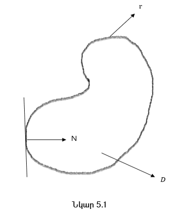

$N$–ը, եզրային տիրույթի յուրաքանչյուր կետում տարված ներքին նորմալ վեկտորն է։ Այժմ, դիտարկենք (1) հավասարումը, և պարզենք դրա ֆիզիկական իմաստը։ $\Delta$ –ն Լապլասի օպերատորն է.

Որը ցույց է տալիս թիթեղի ճկումը (մակերևույթի կորությունը)։ Ընդ որում, եթե $\Delta U = 0$, դա նշանակում է, որ թիթեղը դեֆորմացված չէ, այսինքն հարթ է (նկ. 5.2 a).

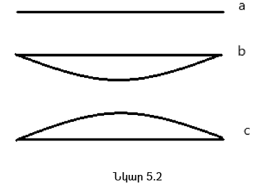

Եթե $\Delta U > 0$, ապա թիթեղը ճկվում է դեպի վերև (նկ. 5.2 c), եթե $\Delta U < 0$, ապա թիթեղը ճկվում է դեպի ներքև (նկ. 5.2 b)։ $\Delta^2$–ն անվանում են Բի-Լապլասյան օպերատոր, այսինքն այն կիրառվում է $U$–ի վրա 2 անգամ.

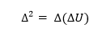

և իրենից ներկայացնում է մակերևույթի ճկման ինտենսիվությունը (կորության փոփոխությունը)։ Առաջին եզրային պայմանը ցույց է տալիս որ թիթեղը եզրերից ամրացված է, այսինքն տեղաշարժի հնարավորություն չկա։ Երկրորդ եզրային պայմանը ցույց է տալիս որ նորմալի ուղղությամբ ածանցյալ հավասար է 0-ի, այսինքն Եզրում թիթեղը չի թեքվում։ (1) Հավասարման 2 եզրային պայմանները միասին, ցույց են տալիս որ թիթեղը կոշտ ամրացված է եզրին։ Այսիքն թիթեղը ներքին տիրույթում կարող է ճկվել  (դեֆորմացվել, ծռվել), իսկ եզրում ոչ։ 

Ձգման , սեղմման, ճկման պայմաններում տարրերի վարքագծի ուսումնասիրությունը սկսվել է Լեոնարդո դա Վինչիից և Գալիլեո Գալիլեյից։ Ռոբերտ Հուկը առաջինն էր, ով ապացուցեց որ մարմինը դեֆորմացվում է ուժի ազդեցության տակ։ Ժամանակի ընթացքում, պինդ մարմինների մեխանիկայի խնդիրներով սկսեցին զբաղվել բազմաթիվ գիտնականներ, որոնց թվում էին՝ Լեոնարդ Էյլերը, Ժոզեֆ-Լուի Լագրանժը, Պուասոնը, Կիրխովը, Թովմաս  Յունգը, և այլոք։ 

Մագիստրոսական թեզում, (1), (2) եզրային խնդիրը լուծվել է 2 տարբեր թվային մեթոդներով՝ ավտոմատ դիֆերենցման և ցանցային դիֆերենցման։

## 5.2 (1), (2) եզրային խնդրի թվային լուծում ցանցային մեթոդով

Դիտարկենք (1), (2) եզրային խնդիրը.

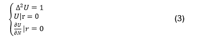

**Քայլ 1.**  
Առաջին քայլով, մինչ դիֆերենցիալ հավասարման ներկայացնելը վերջավոր տարբերությունների տեսքով, նախ ցույց տանք որ պայմանի դեպքում է տարբերութային հավասարումը մոտարկում դիֆերենցիալ հավասարմանը.

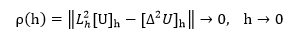

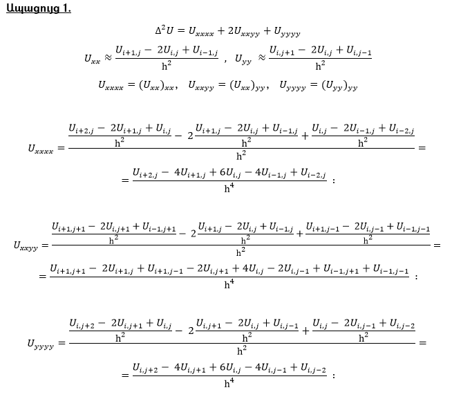

Այսպիսով, ստացվեց որ (3) համակարգը լուծելու համար պահանջվում է 13 կետային (ցանցային)  նմուշ (նկ. 5.3).

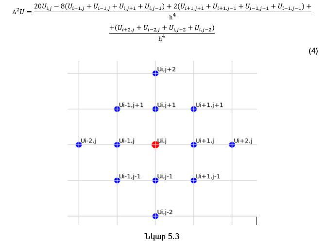

Այժմ, մոտարկման սխալը գտնելու համար օգտվենք Թեյլորի շարքի վերլուծությունից.

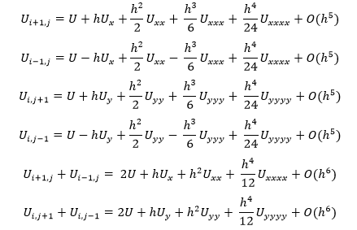

Գումարենք իրար, կստանանք.

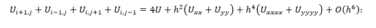

Այժմ, նույնը կատարենք մյուս հանգույցների համար.

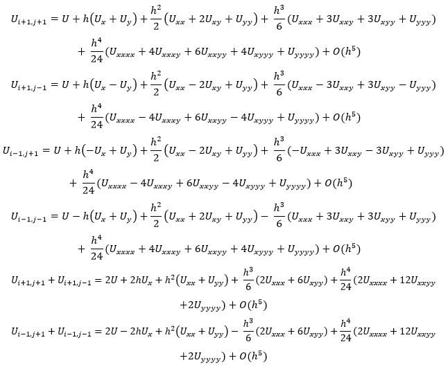

Գումարենք իրար, կստանանք.

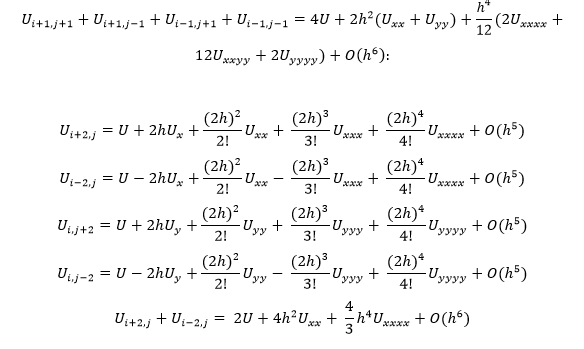

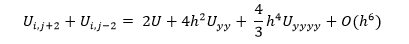

Գումարենք իրար, կստանանք.

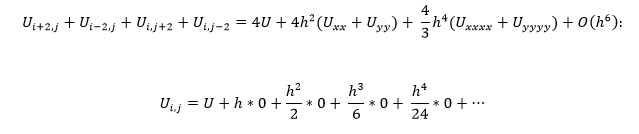

Այժմ, ստացված բոլոր արժեքները տեղադրելով (4)-ում, կստանանք.

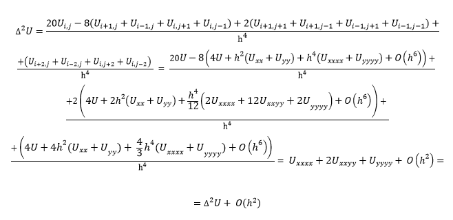

Այսպիսով, ստացվեց որ.

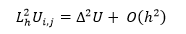

Այսինքն մոտարկման սխալը 2-րդ կարգի է՝ $O(h^2)$, քանի որ սխալի ճշտության կարգը որոշվում է ամենամեծ մնացորդային անդամով։ Ստացանք որ.` $\|L_h^2 U_{(i,j)} - \Delta^2 U\| = O(h^2)$, այսինքն ցանցային օպերատորը մոտարկում է Լապլասի օպերատորը 2-րդ կարգի ճշտությամբ.

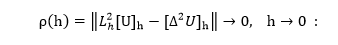

**Քայլ 2.**  
Երկրորդ քայլով այն ներկայացնենք վերջավոր տարբերությունների տեսքով.

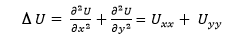

այսինքն, դիֆերենցիալ հավասարումը մոտարկում ենք տարբերութային հավասարումով.

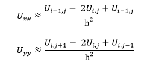

Որտեղ $U_{(i,j)}$–ն ցույց է տալիս ֆունկցիայի արժեքը $U(x,y)$ կետում։

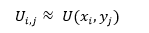

$h$ –ը իրենից ներկայացնում է ցանցի քայլը, որը մեր խնդրում ընդունենք որ  և՛ ուղղագիծ, և՛ հորիզոնական քայլերը իրար հավասար են ($h= 0.25$, ցանցը ունի հորիզոնական և ուղղաձիգ 1 երկարություն, և բաժանված է 4 հավասար մասերի)։ Գումարելով $U_{xx}$, $U_{yy}$–ը իրար կստանանք.

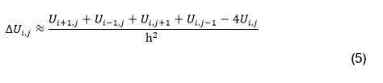

**Քայլ 3.**  
Երրորդ քայլով, $\Delta^2 U$ ներկայացնենք վերջավոր տարբերությունների միջոցով։ Քանի որ, ըստ սահմանման, $\Delta^2 = \Delta(\Delta U)$, կատարենք նշանակում.

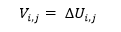

Այստեղից, կհետևի, որ $\Delta V_{(i,j)} = \Delta^2 U_{(i,j)}$։ Այդ դեպքում, կարող ենք $\Delta V_{(i,j)}$–ն ներկայացնել (5) տեսքով.`

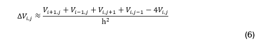

Եթե $V_{(i,j)}$–ն ներկայացնենք $\Delta U_{(i,j)}$–երով, կստանանք հետևյալ հավասարումները.`

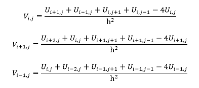

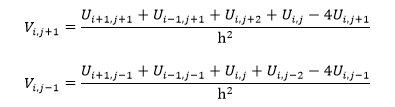

Քանի որ թիթեղի վրա ազդում է հաստատուն ուժ՝ $\Delta^2 U_{(i,j)} = 1$, և ունենք 2 տարբեր տարբերութային հավասարումներ, նախ պետք է սկզբում հաշվել բոլոր $V_{(i,j)}$–երը, հետևյալ տեսքով.`

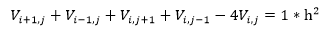

որտեղ $i = 1,2,3$, $j = 1,2,3$, քանի որ ըստ սահմանման, եզրերում թիթեղը ամրացված է, ասյինքն հավասար է $0$–ի  (նկ. 5.4).

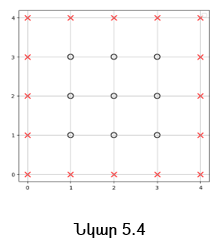

**Քայլ 4.**  
Չորրորդ քայլով, հաշվենք բոլոր $V_{(i,j)}$ –երը։

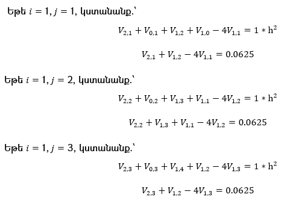

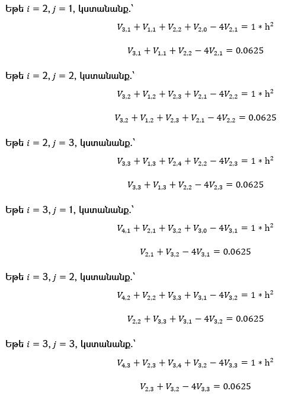

Արդյունքում ստացվում է 9 փոփոխականներից կազմված 9 հատ գծային հավասարումների համակարգ.՝

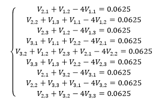

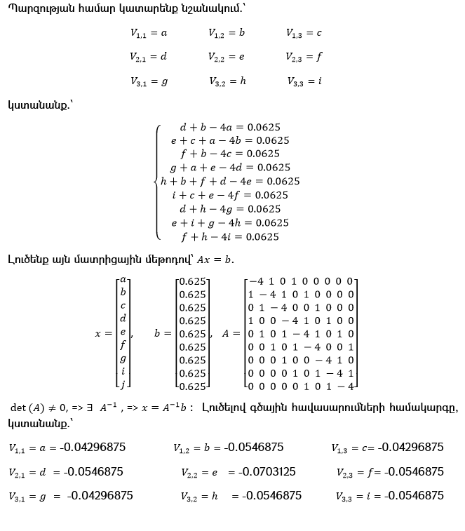

**Քայլ 5.**  
Հինգերորդ քայլով, հաշվենք բոլոր $U_{(i,j)}$ –երը, օգտվելով հետևյալ բանաձևից.`

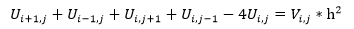

Որտեղ նորից $i = 1,2,3$, $j = 1,2,3$, իսկ եզրային հանգույցներում $U_{(i,j)}$–երը հավասար է $0$–ի։

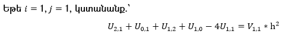

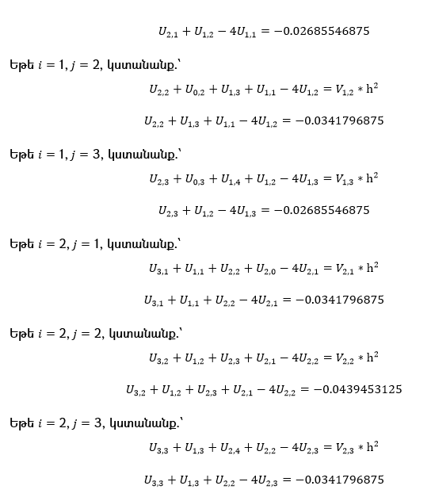

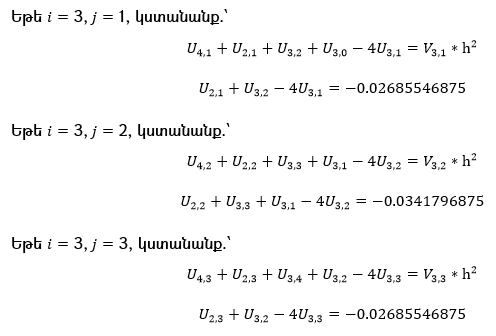

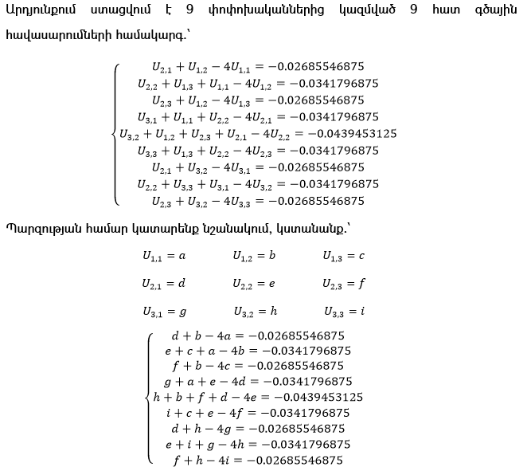

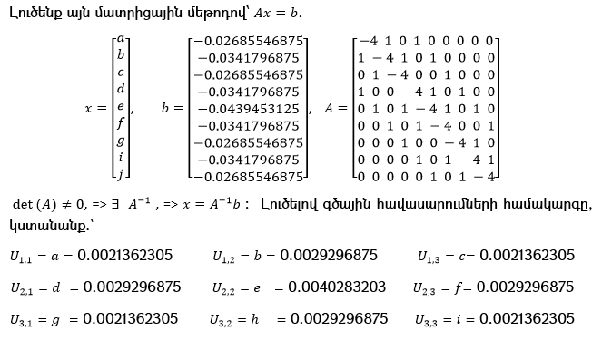

## 5.3 (1), (2) եզրային խնդրի թվային լուծում ավտոմատ մեթոդով

Դիտարկենք նորից (1), (2) եզրային խնդիրը.

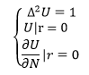

որը, ինչպես տեսանք նախորդ  5.2 ենթագլխում, վերջավոր տարբերությունների միջոցով ներկայացվում էր հետևյալ տեսքով.՝

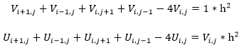

**Քայլ 1.**     
Համաձայն մեր ենթադրության, ունենք 18 հատ անհայտ թվեր (հանգուցային կետեր). 

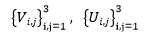

Մենք ի սկզբանե չգիտենք $U(x,y)$ և $V(x,y)$ արժեքները, այդ պատճառով վերցնում ենք (գեներացնում ենք) պատահական բնական թվեր, հաշվի առնելով սկզբնական և սահմանային պայմանները։ Այսինքն մեր մոդելը «սովորելու» է ներքին կետերը $(x_1 y_1, x_1 y_2, x_1 y_3, x_2 y_1, x_2 y_2, x_2 y_3, x_3 y_1, x_3 y_2, x_3 y_3)$ (ներքին հանգույցները) (նկ. 5.3-ում նշված է օղակներով)։

**Քայլ 2.**  
Երկրորդ քայլով, քանի որ մենք ի սկզբանե չգիտենք U(x,y) և V(x,y)  արժեքները, այդ պատճառով օգտագործում ենք մնացորդային մոտարկումը (residual approach-ը)։ Ըստ մեր ենթադրության, ճշգրիտ U(x,y) և V(x,y)   արժեքները այն արժեքներն են, որոնք բավարարում են (1) համակարգին (համակարգի հավասարումներին)։ Կատարենք նշանակում։ Մնացորդները նշանակենք համապատասխանաբար $R_{(i,j)}^V$–ով ու $R_{(i,j)}^U$–ով։ Այդ դեպքում.`

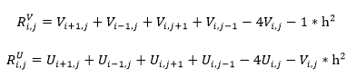

մնացարդները ցույց են տալիս թե որքան ենք շեղվում (1) համակարգի լուծումից։ Եթե մնացորդները շատ մոտ են 0-ին, ապա դա նշանակում է որ ստացված արժեքները արդեն համապատասխանում են (1)-ին և մոտավորապես ճշգրիտ լուծումն ենք ստացել։ 
Եթե $R_{(i,j)}^V = 0$, $R_{(i,j)}^U = 0$  ապա հաշվարկի արդյունքում ստացված արժեքները ճշգրիտ լուծումն է (1) համակարգի համար, իսկ եթե հավասար չեն 0-ի, ապա ստացված արժեքները (1) համակարգի համար ճշգրիտ լուծում չէ ։ 

**Քայլ 3.**  
Երրորդ քայլով, սահմանում ենք կորստի ֆունկցիան (Loss function), որը ցույց է տալիս թե որքանով ստացված արժեքները չի համապատասխանում (բավարարում) (1) համակարգին. 

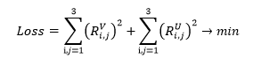

Մեր նպատակն է նվազեցնել և ձգտեցնել այն 0-ի՝ Loss→0։ Այժմ հարց է առաջանում, յուրաքանչյուր  արժեքի համար, որ ուղղությամբ շարժվենք և ինչ չափով որ կորստի ֆունկցիան փոքրանա։ Դրա համար օգտվենք գրադիենտներից (գրադիենտային վայրէջքի մեթոդից)։

**Քայլ 4.**  
Ինչպես գիտենք սովորելու ընթացքում մեր $U(x,y)$ և $V(x,y)$ արժեքները դառնում են դինամիկ փոփոխականներ, որոնք փոփոխվում է քայլ առ քայլ, որպեսզի $Loss \to 0$։ Այսինքն, գրադիենտները կարող ենք հաշվարկել $U(x,y)$–ի և $V(x,y)$–ի նկատմամբ (շնորհիվ $loss.backward()$–ի), և օպտիմալացման ալգորիթմը (գրադիենտային վայրէջքի մեթոդը) կարող է թարմացնել պարամետրերը։

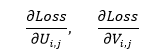

Հաջորդ քայլում, մենք օգտագործում ենք optimizer.step()-ը (օպտիմալացման ալգորիթմը), որը մեր մոդելում գրադիենտային վայրէջքի մեթոդն է։ Այսինքն optimizer-ը վերցնում է գրադիենտը և թարմացնում է արժեքները (պարամետրերը).

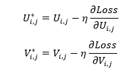

loss.backward() և optimizer.step() քայլերը կրկնվում են հազարավոր անգամ (մեր մոդելում 4000 անգամ)։ Դրա շնորհիվ փոքրանում է Loss-ը և  մոդելը «սովորում» է այն  արժեքները, որոնք լիովին բավարարում են մեր դիֆերենցիալ հավասարումների համակարգին։

Այժմ, հաշվի առնելով այս մեթոդի շնորհիվ ստացված արդյունքները, պատկերենք գրաֆիկ (նկ. 5.4) և կազմենք աղյուսակներ (Աղյուսակ 5.1, Աղյուսակ 5.2), որոնք ցույց են տալիս հարթ թիթեղի ճկման ինտենսիվությունը, և ստացված արդյունքները համեմատենք վերջավոր տարբերությունների մեթոդով ստացված արդյունքենրի հետ։

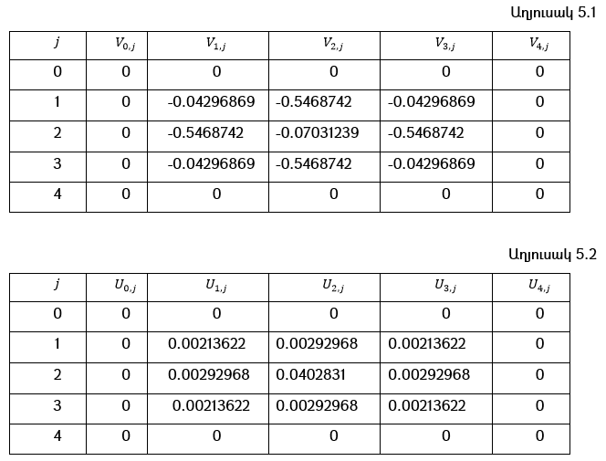

(Աղյուսակ 5.3)-ում ներկայացված է յուրաքանչյուր 500 քայլ հետո Loss-ի արժեքը, որը գնալով (մինչև 1000-րդ քայլը նվազում է, այնուհետև չի փոփոխվում)  նվազում է, և Loss→0.

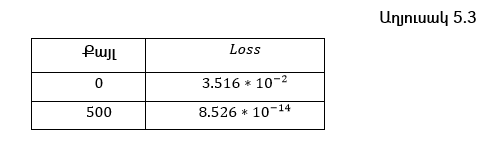

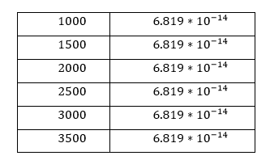

Ինչպես տեսնում ենք 2 մեթոդների դեպքում էլ ստացվում է համարյա նույն արժեքները։ Բայց այն կարող է շատ տարբերվել երբ ցանցը բաժանում ենք ոչ թե $5x5$ մասի, այլ օրինակ $100x100$ մասի, կամ $loss.backward()$ և $optimizer.step()$ քայլերը կրկնում ենք 4000-ի փոխարեն 20000 անգամ, կամ օգտագործում ենք այլ օպտիմալացման ալգորիթմներ, օրինակ Adam optimizer, և այլն։ Այսինքն մեթոդի կայունությունը և ճկունությունը կախված է բազմաթիվ գործոններից, որոնք թույլ են տալիս ստանալ խնդրի լուծումը տարբեր ճշտությամբ կամ տարբեր հաշվարկային և ժամանակային ռեսուրսներ ծախսելով։

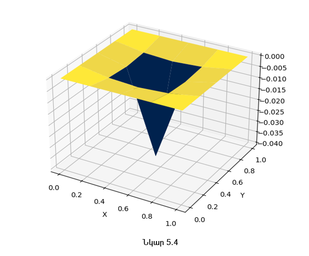

