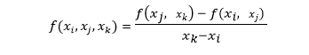

# ԳԼՈՒԽ 1

Ֆունկցիայի ածանցյալների մոտարկման խնդրի ձևակերպումը ։ Թվային դիֆերենցման գաղափարը։

## 1.1 Դիֆերենցիալ հավասարումներ։ Նախնական գաղախարներ

Սահմանում։

Դիֆերենցիալ հավասարում կոչվում է այն ֆունկցիոնալ հավասարումը, որում անհայտ ֆունկցիան մասնակցում է իր ածանցյալների հետ միասին։ Ամենաընդհանուր տեսքով դիֆերենցիալ հավասարումը կարելի է ներկայացնել.

որտեղ  $x$-ը անկախ փոփոխական է $x \in (a,b)$, $y=y(x)$-ը  $x$-ից կախված անհայտ ֆունկցիան  է, իսկ $F$-ը  $(n+2)$ փոփոխականի տրված ֆունկցիա է։  Հավասարման  մեջ անհայտ ֆունկցիայի ամենաբարձր կարգը, կոչվում է նաև դիֆերենցիալ հավասարման կարգ։ $\varphi(x)$ ֆունկցիան կոչվում է հավասարման լուծում $(a,b)$ միջակայքում, եթե $\varphi(x)$-ը $n$ անգամ դիֆերենցելի է $(a,b)$ միջակայքում և  եթե (1) հավասարման մեջ  $y,y',\dots,y^{(n)}$  –ի փոխարեն տեղադրենք համապատասխանաբար $\varphi(x)$  և $\varphi'(x)$, $\varphi''(x)$, ..., $\varphi^{(n)}(x)$ ֆունկցիաները ապա (1)-ը կվերածվի նույնության $(a,b)$ միջակայքում։

Օրինակ։  
$y' - 2y = 0$  

$y = e^{2x}$  ֆունկցիան (1)-ի լուծումն է $\mathbb{R}$-ում։  

$(e^{2x})' - 2e^{2x} = 0$  

$0 = 0$  

=> լուծում է ամբողջ առանցքի վրա $x \in \mathbb{R}$։ Նաև լուծում է հանդիսանում.  

$y = C e^{2x}, \quad C = const$  

(1) հավասարման համար սկզբնական  պայմաններ կոչվում են հետևյալ պայմանները։  

$y(x_0) = y_0,\quad y'(x_0) = y_1,\dots, y^{(n-1)}(x_0) = y_{n-1}$

## 1.2 Բաժանված տարբերություններ

Բաժանված տարբերությունները իրենցից ներկայացնում են ածանցյալի  ընդհանրացումը։ Դիցուկ $f(x)$  ֆունկցիան որոշված է $x_0, x_1, ..., x_m$ կետերը պարունակող ինչ-որ բազմության վրա։ $x_i$ կետերին կանվանենք հանգույցներ ։ Զրոյական կարգի բաժանված տարբերությունները՝ $f(x_i)$-երը,  համընկնում են  $f(x_i)$  ֆունկցիայի արժեքների հետ, իսկ առաջին կարգի տարբերությունները սահմանվում են հետևյալ բանաձևով.

երկրորդ կարգի բաժանված տարբերությունները  սահմանվում են հետևյալ  բանաձևով.

և, ընդհանրապես k –րդ  կարգի բաժաված տարբերությունները սահմանվում են (k-1)-րդ կարգի բաժանված տարբերությունների միջոցով.

