# ԳԼՈՒԽ 1

Ֆունկցիայի ածանցյալների մոտարկման խնդրի ձևակերպումը ։ Թվային դիֆերենցման գաղափարը։

## 1.1 Դիֆերենցիալ հավասարումներ։ Նախնական գաղախարներ

Սահմանում։

Դիֆերենցիալ հավասարում կոչվում է այն ֆունկցիոնալ հավասարումը, որում անհայտ ֆունկցիան մասնակցում է իր ածանցյալների հետ միասին։ Ամենաընդհանուր տեսքով դիֆերենցիալ հավասարումը կարելի է ներկայացնել.

որտեղ  $x$-ը անկախ փոփոխական է $x \in (a,b)$, $y=y(x)$-ը  $x$-ից կախված անհայտ ֆունկցիան  է, իսկ $F$-ը  $(n+2)$ փոփոխականի տրված ֆունկցիա է։  Հավասարման  մեջ անհայտ ֆունկցիայի ամենաբարձր կարգը, կոչվում է նաև դիֆերենցիալ հավասարման կարգ։ $\varphi(x)$ ֆունկցիան կոչվում է հավասարման լուծում $(a,b)$ միջակայքում, եթե $\varphi(x)$-ը $n$ անգամ դիֆերենցելի է $(a,b)$ միջակայքում և  եթե (1) հավասարման մեջ  $y,y',\dots,y^{(n)}$  –ի փոխարեն տեղադրենք համապատասխանաբար $\varphi(x)$  և $\varphi'(x)$, $\varphi''(x)$, ..., $\varphi^{(n)}(x)$ ֆունկցիաները ապա (1)-ը կվերածվի նույնության $(a,b)$ միջակայքում։

Օրինակ։  
$y' - 2y = 0$  

$y = e^{2x}$  ֆունկցիան (1)-ի լուծումն է $\mathbb{R}$-ում։  

$(e^{2x})' - 2e^{2x} = 0$  

$0 = 0$  

=> լուծում է ամբողջ առանցքի վրա $x \in \mathbb{R}$։ Նաև լուծում է հանդիսանում.  

$y = C e^{2x}, \quad C = const$  

(1) հավասարման համար սկզբնական  պայմաններ կոչվում են հետևյալ պայմանները։  

$y(x_0) = y_0,\quad y'(x_0) = y_1,\dots, y^{(n-1)}(x_0) = y_{n-1}$

## 1.2 Բաժանված տարբերություններ

Բաժանված տարբերությունները իրենցից ներկայացնում են ածանցյալի  ընդհանրացումը։ Դիցուկ $f(x)$  ֆունկցիան որոշված է $x_0, x_1, ..., x_m$ կետերը պարունակող ինչ-որ բազմության վրա։ $x_i$ կետերին կանվանենք հանգույցներ ։ Զրոյական կարգի բաժանված տարբերությունները՝ $f(x_i)$-երը,  համընկնում են  $f(x_i)$  ֆունկցիայի արժեքների հետ, իսկ առաջին կարգի տարբերությունները սահմանվում են հետևյալ բանաձևով.

երկրորդ կարգի բաժանված տարբերությունները  սահմանվում են հետևյալ  բանաձևով.

և, ընդհանրապես k –րդ  կարգի բաժաված տարբերությունները սահմանվում են (k-1)-րդ կարգի բաժանված տարբերությունների միջոցով.
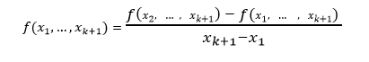

հաճախ, $f(x_1; \ldots; x_k)$ փոխարեն  օգտագործում են նաև հետևյալ նշանակումները.  

$(f)(x_1, \ldots, x_k)$  

կամ  

$[x_1, \ldots, x_k]$  

Սահմանված բանաձևերից հետևում է , որ բաժանված տարբերությունների միջոցով կարող ենք մոտարկել ֆունկցիայի ածանցյալները (նկ. 1.1)։
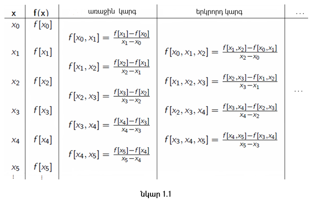

## 1.3 Բաժանված տարբերության հատկություններ

**Հատկություն 1։**

Դիցուք տրված են $(x_k, f(x_k))$,   $k = 1,2,\ldots,m$  ինտերպոլյացիոն տվյալները։ Այդ դեպքում.
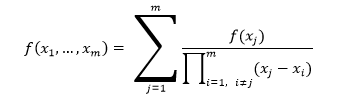

**Ապացույց 1։**  

Ապացուցելու համար օգտվենք մաթեմատիկական ինդուկցիայի մեթոդից։  

$m = 2, \quad \Rightarrow$
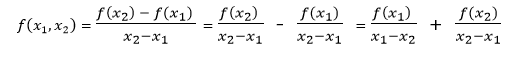

ենթադրենք , որ  k=m բանաձևը ճիշտ է, ապացուցենք այն k=m+1-ի դեպքում.
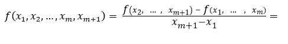

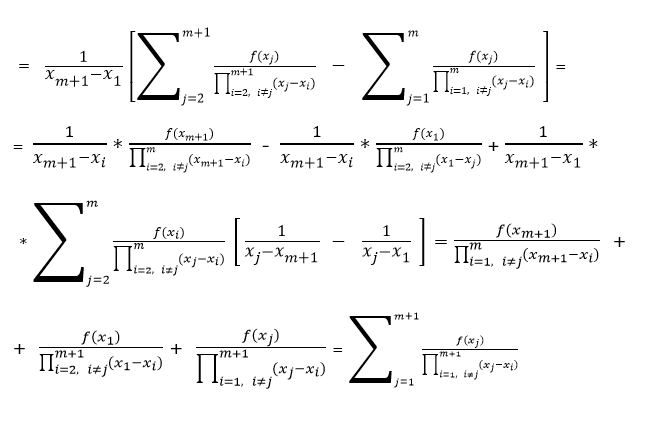

**Հատկություն 2։**  

Բաժանված տարբերությունները (նկ. 1.2) կախված չեն արգումենտների հերթականությունից.
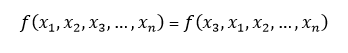

**Ապացույց 2։**  

Ըստ առաջին հատկության՝ կփոխվի միայն հերթականությունը.

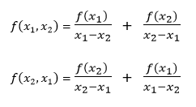

Ապացույցը հետևում է առաջին հատկությունից, քանի որ արգումենտների հերթականությունը փոխելիս, փոխվում է միայն գումարելիների հերթականությունը։

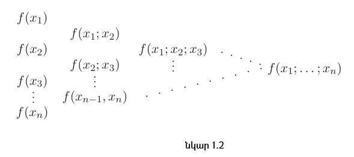

**Հատկություն 3։**  

Դիցուք տրված են $(x_k, f(x_k))$ և  $(x_k, g(x_k))$,   $k = 1,2,\ldots,m$  ինտերպոլյացիոն տվյալները և $\alpha$ ու $\beta$ թվերը։ Այս դեպքում՝

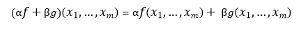

**Ապացույց 3։**  

Վերցնենք տվյալները և կիրառենք բաժանված տարբերությունը։

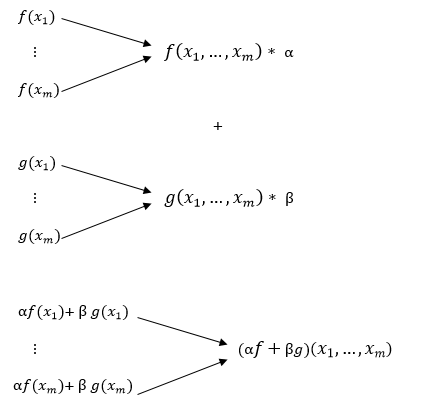

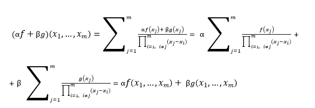

## 1.4 Թվային Դիֆերենցում

Ենթադրենք տրված են $x_0, x_1, \ldots, x_n$ կետերը, և այդ կետերում ֆունկցիայի արժեքները՝ $f(x_0), f(x_1), \ldots, f(x_n)$։ Պահանջվում է գտնել ֆունկցիայի ածանցյալի արժեքը որոշ կետերում։  Ընդհանուր մոտեցումը կայանում է նրանում, որ կառուցվում է ինտերպոլյացիոն բազմանամ՝ $L_n(x)$ (հիմնականում Նյուտոնի կամ Լագրանժի), և այն դիֆերենցվում է, ընդ որում սխալը թվային դիֆերենցման՝ $R_d$-ն  հավասար է ինտերպոլյացիայի սխալի ածանցյալին։

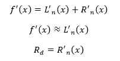

այսինքն թվային դիֆերենցումը իրենից ներկայացնում է ֆունկցիայի ածանցյալների մոտավոր հաշվարկ։ Թվային դիֆերենցման հիմնական բանաձևը հետևյալն է .

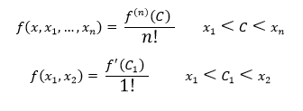

**Օրինակ 1։**  

Ենթադրենք տրված է $x_0, x_1$ կետեր, և այդ կետերում  ֆունկցիայի արժեքները՝ $f(x_0), f(x_1)$։ Նշանակենք $h = x_1 - x_0$։ Օգտվելով բաժանված տարբերությունների աղյուսակից, կարող ենք գրել թվային դիֆերենցման բանաձևը երկու հանգույցի համար.

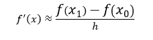

**Օրինակ 2։**  

Ենթադրենք տրված է հետևյալ տվյալները.

